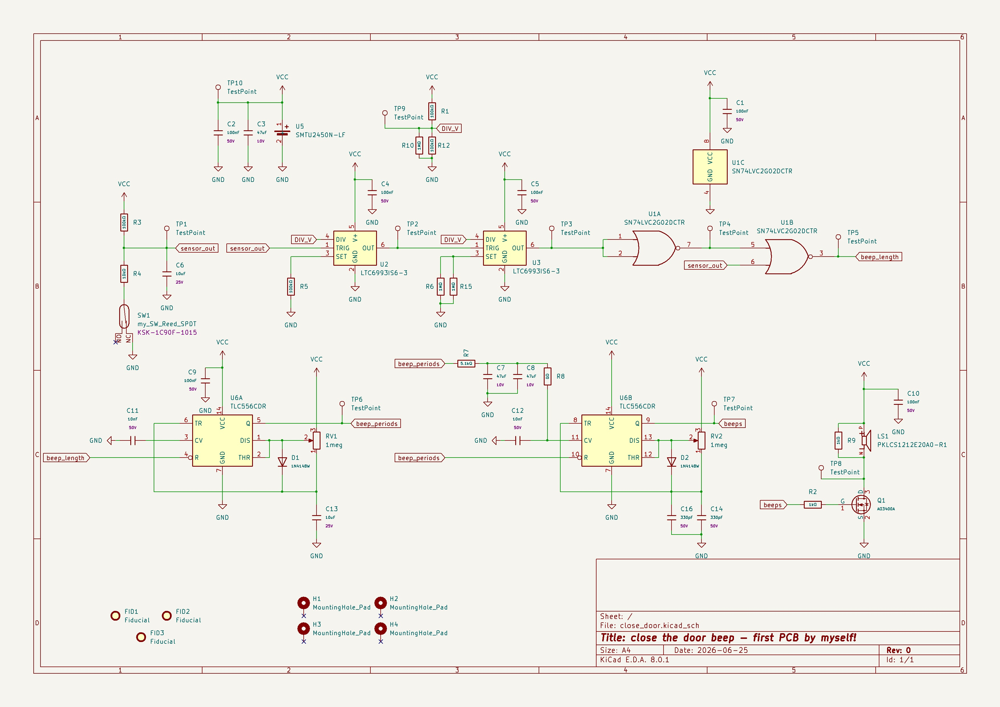

# Close-the-Door Analog Reminder 🚪🔊

A small battery-powered analog reminder circuit for a shared-house door.

If the door is left open for more than a short delay, the circuit emits a gentle beep sequence as a reminder to close it. The design is intentionally implemented without a microcontroller, using discrete analog/timing logic.


## Motivation

This project started from a real everyday problem: people passing through a shared hallway door often leave it open. Instead of using a software-heavy smart-home solution, the goal was to build a small, manufacturable analog PCB and practice the full hardware design flow independently.

## Design Goals

* Fully analog / no MCU
* Battery powered
* Low standby current
* Reed-switch door sensing
* Gentle, non-intrusive acoustic reminder
* Simple PCB suitable for low-cost fabrication and assembly
* Designed as a first independent end-to-end PCB project



## System Overview

The circuit consists of:

* Reed switch for door-state detection
* CMOS timer logic for delay and beep timing
* Logic gates for signal conditioning
* Passive piezo transducer for the sound output
* Coin-cell battery supply
* Test points for bring-up and debugging

Basic behavior:

```text
Door opens
→ delay timer starts
→ if condition is met
→ short beep sequence
→ silence
```

## Hardware

The board was designed in KiCad and sent to fabrication through JLCPCB.

Main design considerations included:

* Low standby current
* Mechanical placement of reed switch and magnet
* Decoupling for CMOS timing ICs
* Passive piezo drive
* Testability during bring-up
* Manufacturable footprints and BOM preparation


## Status

Revision A has been sent to fabrication.

Planned next steps:

* Assemble / receive PCB
* Verify power rails
* Test reed-switch behavior
* Measure timing signals
* Tune beep timing and volume
* Document bring-up results
* Decide changes for Rev B

## License

This project is shared for learning and reference
